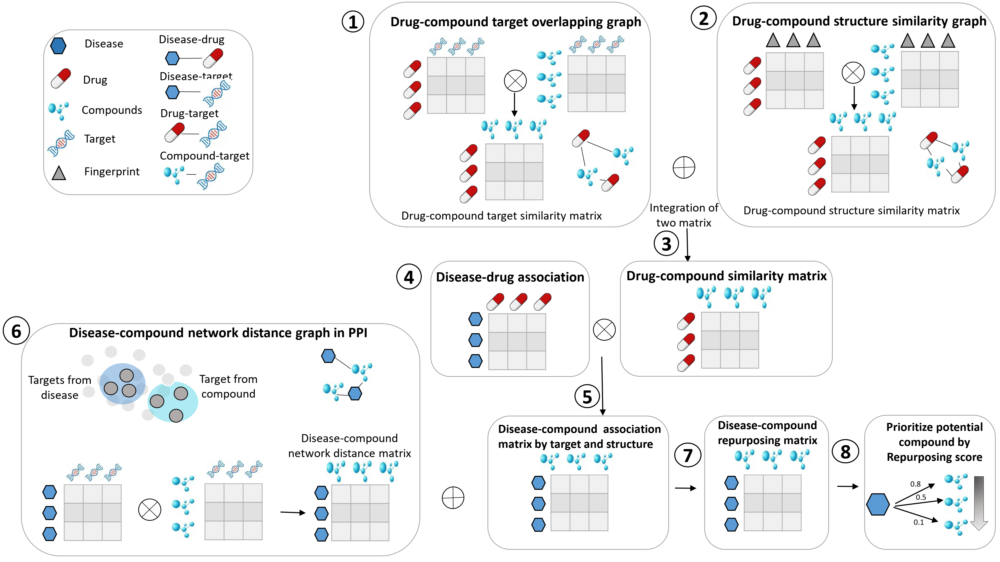
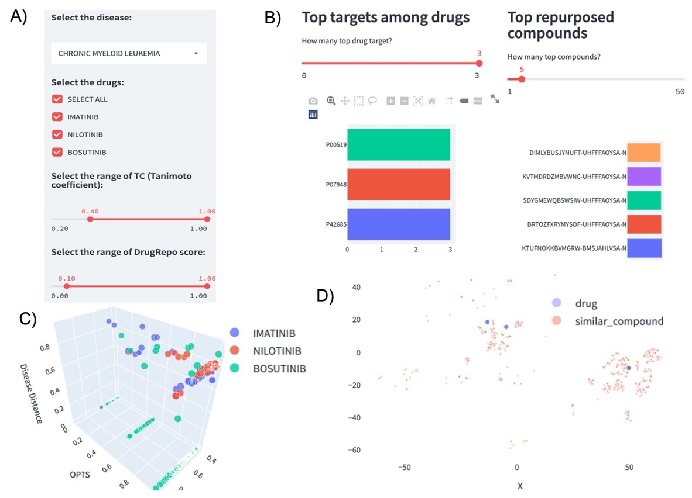

# Drugpro
DrugRepo (http://drugrepo.org/) is a computational pipeline to repurpose drugs for new indications. The repurposing pipeline has various steps including: Compound-target data analysis, structural analysis, gene-disease relationships and network analysis. The pipeline is able to repurpose ~0.8. million compounds across 606 diseases (including various cancers, cardiovascular and kidney diseases).
<figure>
    
</figure>

# Details
Drug development process consumes 9-12 years and approximately one billion US dollars in terms of costs. Due to high finances and time costs required by the traditional drug discovery paradigm, repurposing of old drugs to treat cancer as well as rare diseases is becoming popular. Computational approaches are largely data-driven and involve a systematic analysis of different data types leading to the formulation of repurposing hypotheses.  Thus, we present a novel scoring algorithm, which is based on chemical and genomic data types to repurpose a huge collection of compounds for 674 diseases, including various cancer types and other diseases. The data types used to design the scoring algorithm are chemical structures, drug-target interactions (DTI), pathways, and disease-gene associations. The repurpose scoring algorithm is strengthened by integrating the most comprehensive manually curated datasets for each data type. Details can be seen in DrugRepo: A novel approach to repurpose a huge collection of compounds based on chemical and genomic features (https://www.biorxiv.org/content/10.1101/2022.04.21.488995v).  Our analysis is supported by a web tool DrugRepo available at: http://drugrepo.org/.

# User interface: 
Here we provide a case study on Chronic Myeloid leukemia (CML) using the web interface at http://drugrepo.org/. DrugRepo has three approved drugs (imatinib, nilotinib, and bosutinib) for CML. Users may check one or more of these approved drugs and customize the structural similarity and DrugRepo thresholds **(Figure A)**. The top right space at DrugRepo shows database statistics and workflow diagram. The figure’s section on DrugRepo displays the results for the selected disease and associated approved compounds. Users can take advantage from filter and sorting options to customize the results and can export data for further analysis.  

<figure>
    
</figure>

### There are three figures that can be selected from the Figures dropdown list, i.e., 1) Statistics, 2) Repurposing scores, and 3) *TSNE*. 
1.	The **‘Statistic’** displays the top targets (for approved drugs) and list of repurposing compounds **(Figure B)**. We used standard InChIKey identifiers for the repurposing compounds **(Figure B)**. We used standard InChIKey identifiers for the repurposing compounds instead of names because many of preclinical and investigational compounds haven’t been assigned with proper names. For targets, we used UniProt IDs. 
2.	The **‘Repurposing scores’** provides 3D scatterplot with x-axis as structure similarity score based on tanimoto coefficient (TC), y-axis as overlapping compound-targets score (OCTS), and z-axis as compound-disease score (CDS). In the scatter plot, each point is a pair of approved drug and repurposed compounds. Repurposing compounds are assigned with colors like the most associated approved drug **(Figure C)**. More details about disease, approved drug, repurposing compound, and the three scores shown if users click on the point. 
3.	T-distributed stochastic neighbour embedding **(TSNE)** is used to visualize 2D similarity between approved drugs (purple) and repurposing compound (red) as shown in **Figure D**. The 2D similarity was computed based on ECFP4 fingerprints.

### There are four tables in ‘Tables’ dropdown list, 1) Drug repurposing table, 2) Approved drugs for the disease, 3) Disease-gene associations, 4) Drug target profiles for drug and compounds. 
1.	**‘Drug Repurposing’** table provides four scores (TC, OCTS, CDS and DrugRepo) between approved and repurposing drugs. 
2.	**‘Approved drugs for the disease’** table display UML-CUIs for the selected disease and standard InChIKeys of the approved drugs. 
3.	**‘Disease-gene associations’** table displays the genes associated with the selected disease. 
4.	Finally, **‘Drug target profiles for drug and compounds’** table provides a list of drug targets associated with approved drugs and repurposing compounds.
